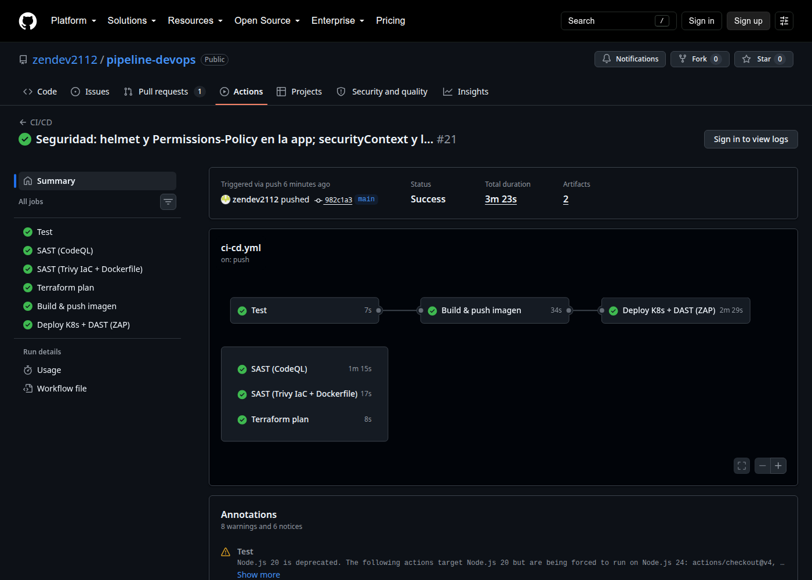
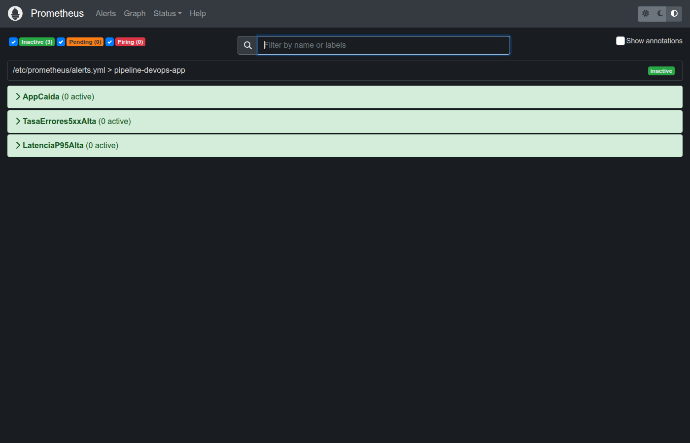
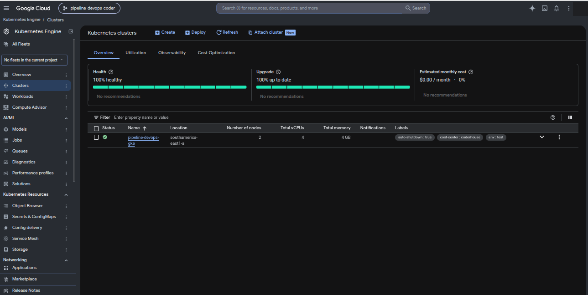
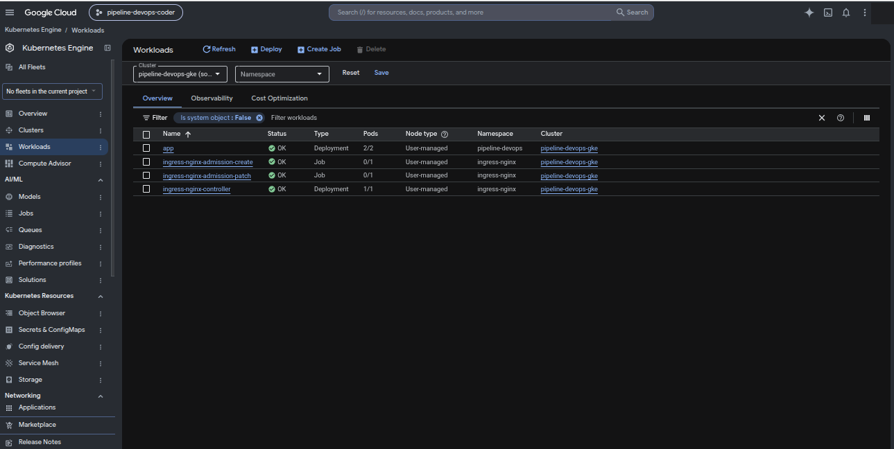
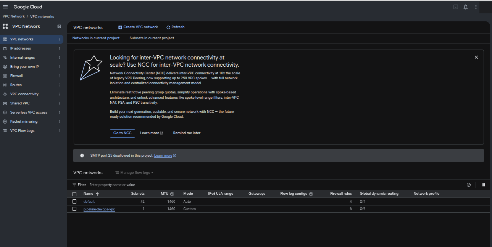
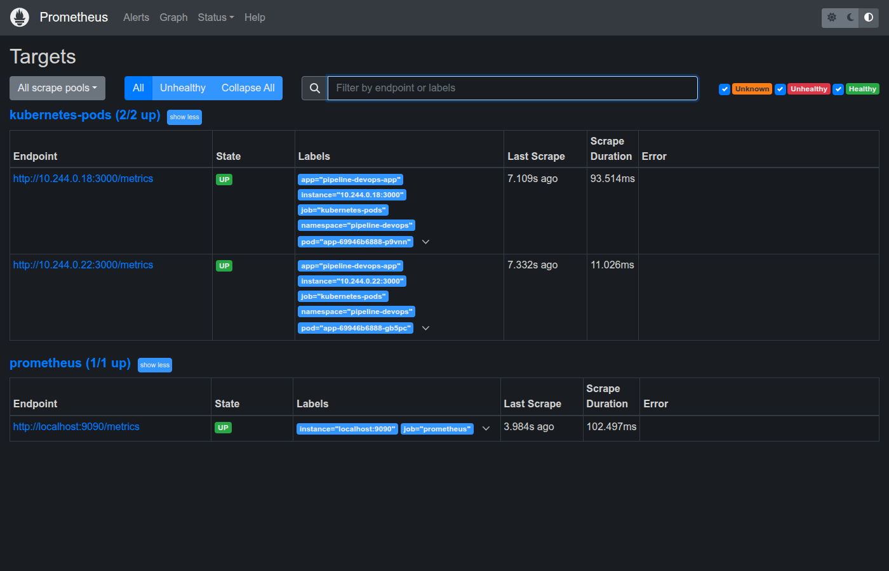
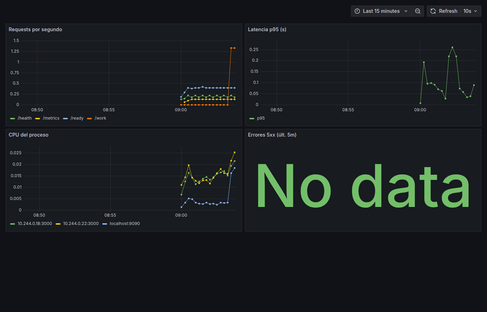

# Informe · Proyecto final DevOps (Coderhouse)

**Alumno:** Zenón Deviagge · **Fecha:** 2 de octubre de 2026 · **Repositorio:** https://github.com/zendev2112/pipeline-devops

Versión editable del informe (con diagrama e imágenes): https://claude.ai/code/artifact/87f835e3-cc46-4eff-aa8b-9f3dde8e519b

## 1. Descripción del proyecto

Pipeline CI/CD completo para una API HTTP en Node.js: desde el commit hasta un despliegue en Kubernetes con auto-escalado, monitoreo y análisis de seguridad automatizados. La aplicación es deliberadamente pequeña para que el foco esté en la infraestructura: expone `/` (identidad del servicio y del pod), `/health` y `/ready` (probes), `/metrics` (formato Prometheus con `prom-client`) y `/work` (consume CPU para provocar el HPA). Tiene cuatro tests con `node:test`.

| Componente | Herramienta | Ruta |
| --- | --- | --- |
| Aplicación + tests | Node.js 22, Express, prom-client | `app/` |
| Imagen | Docker multi-stage (3 etapas) | `Dockerfile` |
| Infraestructura | Terraform 1.16, provider google 6.x, módulos `network` y `gke` | `terraform/` |
| CI/CD | GitHub Actions, 6 jobs | `.github/workflows/ci-cd.yml` |
| Orquestación | Kubernetes 1.34 (kind local y en CI; GKE con Terraform) | `k8s/` |
| Monitoreo | Prometheus + Grafana (lite sin operador, y kube-prometheus-stack con Helm) | `monitoring/` |
| SAST / DAST | CodeQL, Trivy, OWASP ZAP | workflow |
| Operación | scripts de kind, carga, bootstrap GCP, apagado FinOps | `scripts/` |

## 2. Dockerfile multi-stage

Imagen final de 173 MB, sin root, solo runtime + dependencias de producción + código. Tres etapas sobre `node:22-alpine`:

1. **deps**: `npm ci --omit=dev` con caché de npm montada.
2. **test**: instala dependencias de desarrollo y corre `npm test`; si falla, el build se corta.
3. **runtime**: copia `node_modules` de *deps* y el código, usuario `app` con UID 10001, `HEALTHCHECK` sobre `/health`.

La etapa *runtime* copia un marcador generado por *test*, de modo que la imagen final solo existe si los tests pasaron. Decisiones: UID numérico (Kubernetes con `runAsNonRoot` rechaza usuarios por nombre), Alpine frente a la imagen completa (173 MB vs. más de 1 GB), y `docker-compose.yml` como primer escalón local.

## 3. Terraform

Módulo raíz y dos módulos propios. `validate` corre en cada push. El 2/10/2026 se ejecutó el `apply` real sobre un proyecto de Google Cloud: creó la VPC, la subred, el cluster GKE y el node pool, se desplegó la app encima y después se destruyó todo (evidencias 13 a 20).

| Módulo / archivo | Qué crea |
| --- | --- |
| `modules/network` | VPC sin subredes automáticas, subred regional con rangos secundarios para pods y services, acceso privado a APIs |
| `modules/gke` | Cluster GKE zonal (canal REGULAR) y node pool con autoscaling 1 a 3, auto-repair, auto-upgrade, Secure Boot |
| `variables.tf` | `project_id`, `region`, `zone`, `machine_type`, `min_nodes`, `max_nodes`, `preemptible`, `labels` |
| `outputs.tf` | nombre y zona del cluster, comando `get-credentials` |
| `versions.tf` | versiones mínimas y backend `gcs` listo para descomentar |

Defaults de costo mínimo: `southamerica-east1`, `e2-small`, preemptibles, `pd-standard` 30 GB, cluster zonal. `scripts/tf-bootstrap.sh` habilita APIs y crea el bucket versionado de estado.

## 4. Pipeline CI/CD

Seis jobs en cada push y PR a `main`; tres en cadena (Test → Build & push → Deploy) y tres en paralelo (CodeQL, Trivy config, Terraform). Run completo en unos 4 minutos.

```
push → Test ─────────► Build & push imagen ─────► Deploy en kind + smoke test + ZAP
       CodeQL (SAST)   Trivy config (IaC)         Terraform fmt/validate/plan   (en paralelo)
```

| Job | Qué hace | Depende de |
| --- | --- | --- |
| Test | `npm ci`, lint, `npm test` con Node 22 | nada |
| SAST (CodeQL) | análisis estático del JavaScript → pestaña Security | nada |
| SAST (Trivy IaC + Dockerfile) | Dockerfile, manifiestos, Terraform → SARIF a Security | nada |
| Build & push imagen | buildx con caché, tags `sha-<commit>` y `latest`, push a ghcr.io, Trivy sobre la imagen | Test |
| Terraform plan | `fmt -check`, `init`, `validate`; con credenciales también `plan` como artefacto | nada |
| Deploy K8s + DAST | cluster kind en el runner, ingress-nginx, metrics-server, manifiestos, smoke test, ZAP baseline | Build & push |

Secretos: `GITHUB_TOKEN` automático para ghcr.io; `GCP_PROJECT_ID` y `GCP_SA_KEY` opcionales para Terraform. `terraform apply` solo desde *Run workflow* con `terraform_apply` marcado. Dependabot semanal ignorando versiones mayores.

## 5. Kubernetes

Manifiestos en `k8s/`, aplicados con `kubectl apply -k k8s/`, idénticos en kind, CI y GKE: Namespace, ConfigMap, Deployment (2 réplicas, RollingUpdate con `maxUnavailable: 0`, probes, requests 100m/64Mi, limits 250m/128Mi), Service ClusterIP, Ingress nginx (`app.localtest.me`), HPA `autoscaling/v2` de 2 a 6 réplicas al 50 % de CPU, ServiceMonitor. Pod endurecido: `runAsNonRoot` UID 10001, `readOnlyRootFilesystem`, sin escalada, capabilities descartadas, seccomp `RuntimeDefault`.

Prueba de carga (`docs/evidencias/03-hpa-escalado-bajo-carga.txt`): CPU del 19 % al 204 % del request, 6 réplicas a los 48 s, vuelta al 13 % dos minutos después de cortar la carga.

## 6. Monitoreo

Prometheus scrapea `/metrics` de cada pod cada 15 s; Grafana muestra un dashboard provisionado con requests/s por ruta, latencia p95, CPU del proceso y errores 5xx.

| Variante | Qué instala | Cuándo |
| --- | --- | --- |
| `monitoring/lite/` (default local) | Prometheus y Grafana como Deployments planos, descubrimiento por anotaciones `prometheus.io/*`, ~250 MB | clusters locales chicos (la notebook: 2 núcleos, 7 GB, VM de Docker de 1,7 GB) |
| `kube-prometheus-values.yaml` con Helm | kube-prometheus-stack completo, usa el ServiceMonitor | GKE, o local con `MONITORING=full` y ≥ 4 GB en Docker Desktop |

Alertas: la variante lite carga tres reglas (`alerts.yml` en el ConfigMap de Prometheus): `AppCaida` (ningún pod responde al scrape durante 1 min), `TasaErrores5xxAlta` (más del 5 % de requests con 5xx durante 2 min) y `LatenciaP95Alta` (p95 mayor a 500 ms durante 5 min). No hay Alertmanager: las alertas se ven en la pantalla Alerts de Prometheus, sin notificación externa.

El stack completo saturaba el API server local y el scheduler perdía la elección de líder; la variante lite se escribió para demostrar el monitoreo en esta máquina sin renunciar al stack completo en la nube.

## 7. Seguridad (SAST / DAST)

| Análisis | Tipo | Resultado al 2/10/2026 |
| --- | --- | --- |
| CodeQL | SAST | sin alertas |
| Trivy config | IaC | 15 hallazgos abiertos (eran 30; 27 alertas cerradas en total): 9 sobre Terraform (cluster no privado, sin network policy, sin flow logs, sin service account dedicada para los nodos), 2 sobre el Deployment de la app (tag `latest`, registry no restringido) y 4 sobre Prometheus/Grafana lite (registry, UID de Grafana menor a 10000) |
| Trivy image | imagen | sin HIGH/CRITICAL |
| OWASP ZAP baseline | DAST | 1 medio y 1 informativo (eran 1 medio, 4 bajos, 1 informativo). Queda una directiva CSP sin fallback |

Corregido el 2/10: `helmet` y `Permissions-Policy` en Express (cerró los 4 hallazgos bajos de ZAP); `securityContext` sin root, sistema de archivos de solo lectura, capabilities descartadas y límite de CPU en Prometheus y Grafana lite. Deuda conocida: los 9 hallazgos de Terraform son endurecimientos de GKE (cluster privado, redes autorizadas, network policy) que se dejaron fuera para mantener el cluster de pruebas simple y barato. Ninguna credencial en el repo.

## 8. FinOps

Nodos spot (hasta 80 % más baratos), autoscaling 1 a 3 nodos `e2-small`, HPA con requests/limits, cluster zonal (plano de control en cuota gratuita), discos `pd-standard`, `finops-shutdown.sh scale-zero|destroy`, labels `env`/`owner`/`cost-center`/`auto-shutdown`, caché de build en CI, retención corta en Prometheus. Una hora de pruebas en GCP: 0,05 a 0,08 USD de cómputo.

## 9. Cómo ejecutar y validar

Ver README: nivel 1 `docker compose up --build`; nivel 2 `./scripts/local-up.sh` (kind + ingress + metrics-server + monitoreo + app) y `./scripts/load-test.sh` para el HPA; nivel 3 `tf-bootstrap.sh`, `terraform apply`, `kubectl apply -k k8s/`, `finops-shutdown.sh destroy`.

## 10. Evidencias

En `docs/evidencias/`: `01-smoke-test-ingress.txt`, `02-kubectl-estado-cluster-local.txt`, `03-hpa-escalado-bajo-carga.txt`, `04-prometheus-targets.txt`, `05-prometheus-targets.png`, `06-grafana-dashboard.png`, `07-github-actions-run.txt`, `08-prometheus-alertas.png`, `09-github-actions-run.png`, `10-github-actions-historial.png`, `11-seguridad-sast-dast.txt`, `12-ghcr-imagen-publicada.txt`. `13-terraform-apply.txt`, `14-gke-despliegue.txt`, `15-terraform-destroy.txt`, `16` a `20-gcp-*.png`. Último run verde: 37032715308.















## 11. Log de dificultades y soluciones

Ver [`log-dificultades.md`](log-dificultades.md): 18 problemas con causa y solución, del disco lleno al UID no numérico.

## 12. Estado del entregable

Funcionando al 95 %. Todo lo que pide la consigna existe, está en el repo y fue probado, incluida la infraestructura real en Google Cloud.

| Requisito | Estado |
| --- | --- |
| Repositorio con commits claros | 100 % |
| Dockerfile multi-stage | 100 % |
| Terraform con variables y módulos | 100 % (apply real en GCP el 2/10, luego destroy) |
| Pipeline CI/CD completo | 100 % |
| Manifiestos K8s + HPA | 100 % |
| Monitoreo | 95 % (lite probado con dashboard y 3 alertas; Helm completo no probado en esta máquina) |
| FinOps | 95 % (spot, autoscaling y labels verificados en GCP; recursos destruidos tras las pruebas) |
| README y evidencias | 100 % |

Deuda conocida: integrar el `apply` y el despliegue a GKE dentro del pipeline con una service account (hoy el pipeline despliega en kind y el apply fue manual); endurecer GKE según los 9 hallazgos de Trivy; activar el estado remoto en GCS; probar `MONITORING=full` y agregar Alertmanager.

**Conclusiones.** Lo costoso no fue ninguna herramienta sino la integración: los fallos aparecieron en las junturas. El diagnóstico automático en el job de deploy acortó cada iteración, y los límites de la máquina llevaron a una mejora: monitoreo liviano para entornos chicos y completo para la nube.
